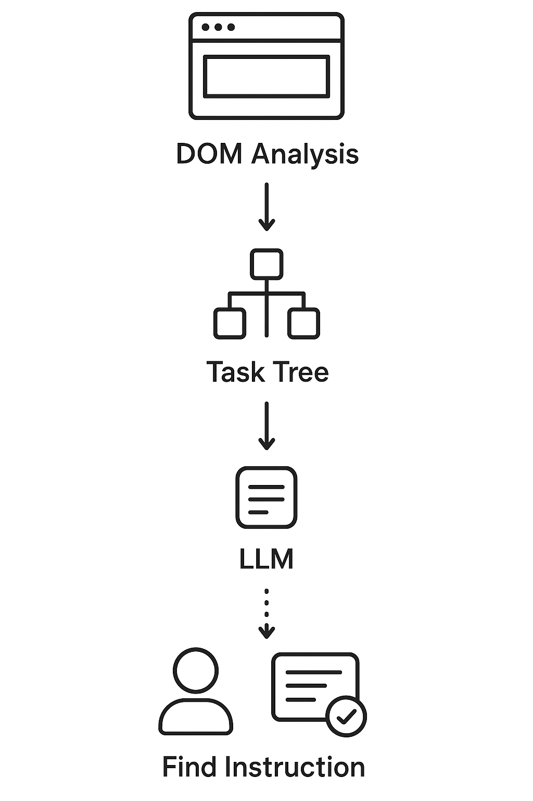

# 🧑‍💻 Умный коллега

Автономный ИИ-ассистент, который изучает веб‑сервис и в реальном времени подсказывает пользователю, что делать.

---

## 📝 Архитектура системы
<!--  -->


Ассистент состоит из нескольких ключевых модулей:
- DOM-сканер
- LLM процессор
- Виджет помощи
- Каталог сценариев

---

## 🌠 Возможности
- Автоматическое изучение интерфейса
- Пошаговые подсказки
- Контекстная помощь
- Генерация руководств

---

## ▶️ Установка и запуск
### Установка
```git clone https://github.com/asanaaa/smart_colleague.git
cd smart_colleague/src
```

### Установка зависимостей
```
pip install -r requirements.txt
npm install jsdom
```
Запустите статический сайт (из корня проекта или директории с index.html):
```
python -m http.server 8000
```
Сайт будет доступен по адресу:
```
http://localhost:8000/index.html
```
### Создание дерева задач и инструкций
```
python .\analyzer.py
```
### Запуск ассистента
```
python .\assistant_api.py
```
Сервис поднимется и начнет анализировать входящие запросы

---

## 📒 Пример использования
1. Пользователь открывает страницу.
2. Нажимает кнопку чата в правом нижнем углу.
3. Ассистент анализирует DOM.
4. Генерирует точные шаги.

---
###  Вы можете посетить [GitHub Pages](https://asanaaa.github.io/smart_colleague/ "Перейти на GitHub Pages") чтобы посмотреть как выглядит синтетический сайт.
